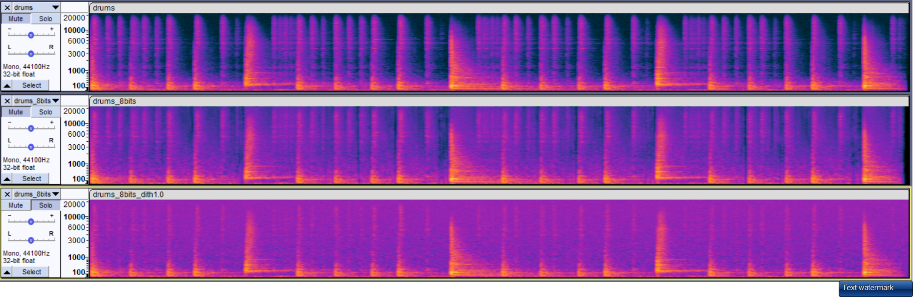

Mikalai Stelmakh

# Wstęp do Multimediów - Dźwięk

## 1. Analiza widma i spektrogramu dźwięków

### 1.  Pojedyncze tony

- Wygeneruj ton o częstotliwości 1000 Hz i amplitudzie 0,5.

  

- Wyświetl widmo sygnału (Analizuj - Narysuj widmo) i sprawdź, jaki wpływ na wygląd widma ma zmiana rozmiaru okna analizy widmowej (Rozmiar: …)

  | Rozmiar | 128                                                          | 512                                                          | 2048                                                         | 8192                                                         |
  | :------ | ------------------------------------------------------------ | ------------------------------------------------------------ | ------------------------------------------------------------ | ------------------------------------------------------------ |
  | Widmo   |  |  |  |  |

  *Im większy rozmiar okna, tym bardziej wykres skupiony jest w pobliżu 1 kHz.*

- Sprawdź, jaki wpływ na widmo sygnału ma rodzaj zastosowanego okna (Funkcja: …)

  | Funkcja | Rectangular                                                  | Hamming                                                      | Blackman                                                     | Gaussian(a=3.5)                                              |
  | :------ | ------------------------------------------------------------ | ------------------------------------------------------------ | ------------------------------------------------------------ | ------------------------------------------------------------ |
  | Widmo   |  |  |  |  |

  *Wykresy dla wszystkich funkcji skupione są w pobliżu 1 kHz. Od rodzaju zastosowanego okna zależy stopień rozlewania się widma na inne częstotliwości.*

  ---

- Klikając czarny trójkąt przy nazwie ścieżki zmień widok na „Spektrogram”

- Zaobserwuj, jak wygląda spektrogram dla wygenerowanego tonu (pojedynczej  częstotliwości)

  

  *Spektrogram wygląda jako jedna linia na poziomie częstotliwości równej 1 kHz.*

  ---

- Wygeneruj kolejny ton (będąc „odklikniętym” z poprzedniej ścieżki), o częstotliwości 2000 Hz i amplitudzie 0,3

- Zaznacz obie ścieżki i w menu wybierz Ścieżki – Miksuj – Miksuj i renderuj

- Zaobserwuj, jak wygląda spektrogram

  

  *Na spektrogramie widać dwie linie skupione w pobliżu 1 kHz i 2 kHz.*

### 2. Dźwięki muzyczne

- Zaimportuj ścieżkę „flet.wav”

- Posłuchaj i wyświetlając widmo sygnału, sprawdź, jaka jest częstotliwość dźwięku, który gra  flecistka

  

  *Częstotliwość podstawowa dźwięku jest równa 444 Hz.*

- Zaobserwuj, jak wygląda na spektrogramie dźwięk instrumentu muzycznego – zwróć uwagę  na występowanie wielu częstotliwości harmonicznych (wielokrotności częstotliwości  podstawowej)

  *Na wykresie widać kilka pików o częstotliwości wielokrotnej częstotliwości podstawowej.*

---

- Zaimportuj ścieżkę „oboj_piano.wav” oraz osobno „oboj_forte.wav”

- Posłuchaj kolejno każdej ze ścieżek i zobacz na spektrogramie, w jaki sposób różnica w  barwie dźwięku pomiędzy instrumentem grającym cicho (piano) i głośno (forte) widoczna jest  na spektrogramie

  

  *Spektrogram dźwięku forta ma więcej częstotliwości oraz jest jaśniejszy niż spektrogram dźwięku piana.*

---

- Zaimportuj ścieżkę „waltornia.wav”

- Zmień pionową skalę spektrogramu z liniowej na logarytmiczną (kliknięcie prawym  przyciskiem myszy na skali po lewej stronie wykresu) i słuchając nagrania zobacz, jak na  spektrogramie widoczna jest melodia, którą gra waltornista.

  

  *Im wyższy dźwięk jest grany, tym "wyżej" pokazany jest on na spektrogramie, im niższy - tym "niżej". Widać też momenty wdechów waltornisty.*

### 3. Mowa

- Zaimportuj ścieżkę „mowa_mezczyzna.wav” oraz osobno „mowa_kobieta.wav”

- Na podstawie widma obu sygnałów przeanalizuj, w jakich zakresach częstotliwości więcej  energii ma dźwięk mowy męskiej, a w jakich mowy kobiecej (lepiej będzie to widać  ustawiając liniową skalę poziomą wykresu)

  - Mężczyzna

    

  - Kobieta

    

  *Dźwięk mowy męskiej ma więcej energii w częstotliwościach z zakresu [0 kHz - 4 kHz].*

  *Dźwięk mowy kobiecej ma więcej energii w częstotliwościach z zakresu [4 kHz - 12 kHz]. *

## 2. Edycja dźwięków

### 1. Mowa

-  Otwórz ścieżkę „mowa_kobieta.wav” oraz osobno „mowa_mezczyzna.wav”

- Zastosuj filtrację górnoprzepustową (zaznacz ścieżkę, Efekt – Filtr górnoprzepustowy) do  ścieżki z mową kobiecą, tj. odfiltruj dolne częstotliwości dźwięku, stosując ustawienia:  częstotliwość graniczna 200 Hz, rolloff 24 dB/oktawę

- Zobacz różnicę w widmie przed i po filtracji. Posłuchaj ścieżki mowy kobiecej po filtracji – czy  utracona została jakaś istotna część sygnału?

  | Przed filtracją                                              | Po filtracji                                                 |
  | ------------------------------------------------------------ | ------------------------------------------------------------ |
  |  |  |

  *Nie, mowa kobiety nadal jest dobrze zrozumiała i wyraźna*

- Zastosuj taką samą filtrację górnoprzepustową (te same parametry), do mowy męskiej.  Zaobserwuj widmo przed i po filtracji. Posłuchaj ścieżki mowy męskiej – czy przy filtracji  utracona została istotna część sygnału w porównaniu do mowy kobiecej?

  | Przed filtracją                                              | Po filtracji                                                 |
  | ------------------------------------------------------------ | ------------------------------------------------------------ |
  |  |  |

  *Tak, w tym przypadku otrzymujemy dźwięk o gorzej jakości.*

---

-  Do mowy kobiecej zastosuj dodatkowo filtrację dolnoprzepustową, tj. odfiltruj wysokie  częstotliwości sygnału, stosując ustawienia np: 8 000 Hz, 24 db/okt

- Stosując różne wartości częstotliwości granicznej filtru, sprawdź, przy jakiej częstotliwości  utracona zostaje wyrazistość mowy, a przy jakiej zrozumiałość.

  *Wyrazistość zostaje utracona przy częstotliwości ok. 5 kHz.*

  *Zrozumiałość zostaje utracona przy częstotliwości ok. 500 Hz.*

## 2. Eliminacja zakłóceń

- Zaimportuj ścieżkę „ton_trzaski.wav” i posłuchaj – w nagraniu znajduje się ton i zakłócenia  (trzaski)

  

- Przełącz widok ścieżki na spektrogram, zaobserwuj występowanie trzasków, które nie były  widoczne na przebiegu czasowym sygnału, a następnie ponownie rozwiń menu przy nazwie  ścieżki i włącz „Ustawienia spektrogramu”.

  

- Sprawdź, jak rozmiar okna analizy fft wpływa na wygląd spektrogramu. Zmieniaj po kolei  rozmiar okna z 1024 na coraz mniejsze, a później coraz większe i zobacz, który rozmiar jest  najlepszy dla uzyskania największej rozdzielczości w dziedzinie czasu (pozioma oś), a który  zapewnia najlepszą rozdzielczość w dziedzinie częstotliwości (pionowa oś)

  | Rozmiar okna | Spektrogram                                                  |
  | ------------ | ------------------------------------------------------------ |
  | 128          |  |
  | 256          |  |
  | 512          |  |
  | 1024         |  |
  | 2048         |  |
  | 8192         |  |
  | 32768        |  |

  *Największą rodzdzielczość w dziedzinie czasu orzymujemy dla okna o rozmiarze 256.*

  *Największą rodzdzielczość w dziedzinie częstotliwości orzymujemy dla okna o rozmiarze 32768.*

---

Przy optymalnych ustawieniach okna analizy dla widoczności trzasków (których czas trwania  jest bardzo krótki) spróbuj usunąć zakłócenia w następujący sposób:

1. W widoku spektrogramu zaznacz fragment, w który występuje trzask
2. Przełącz widok na przebieg czasowy
3. W menu wybierz Zaznacz – Na miejscach przejść przez zero (to pozwoli uniknąć  nieciągłości sygnału na krańcach zaznaczenia)
4. Usuń zaznaczony fragment (pojedynczy trzask) naciskając delete
5. Posłuchaj nowej wersji ścieżki

---

- Zaimportuj ścieżkę „gitara_pisk.wav”

- Zaobserwuj na spektrogramie, jakiego rodzaju zakłócenie występuje w tym nagraniu

  *Dźwięk o częstotliwości 10 kHz*

  

   i spróbuj  je usunąć w następujący sposób:

  1. Zaznacz odpowiedni fragment spektrogramu (dany zakres częstotliwości w całym czasie  trwania zakłócenia)
  2. Spróbuj usunąć zakłócenie używając filtra notch (Efekt – Filtr Notch) o odpowiednich  parametrach
  3. Posłuchaj nowej wersji ścieżki

  

## 3. Lateralizacja źródła dźwięku

-  Do tego zadania niezbędne są słuchawki!

- Zaimportuj ścieżkę „lektor.wav”

- Zaznacz zaimportowaną ścieżkę i powiel ją (Edycja – Powiel)

- Jedną ze ścieżek ustaw w panoramie (suwak L – P pod nazwą ścieżki) na prawo, a drugą na  lewo

- Kliknij kursorem w jakieś miejsce ścieżki, gdzie amplituda sygnału jest duża

- Klikając „lupkę” przybliż przebieg czasowy tak, aby na skali były tysięczne części sekundy

- Zmień typ kursora na poziomą podwójną strzałkę (↔)

- Przesuń jedną ze ścieżek w prawo lub w lewo o tysięczne części sekundy

- Posłuchaj, jak po przesunięciu zmienia się położenie pozornego źródła dźwięku

  *Dźwięk słyszalny jest po tej stronie, po której wcześniej zaczyna się fala dźwiękowa.*

- Jeśli przesuniesz ścieżkę o zbyt dużą wartość, zniknie wrażenie przesuwania się źródła  dźwięku, a powstanie wrażenie „echa”

  

## 4. Próbkowanie i kwantyzacja

-  zaimportuj pliki "drums_sweep.wav", " drums_sweep_convert_Fs11025Hz.wav" i  "drums_sweep_convertFs11025Hz_filtering.wav"

  

- posłuchaj i oceń brzmienie każdego pliku (drugi z nich to konwersja z fs = 44 100 Hz na  11 025 Hz bez odpowiedniej filtracji sygnału, a trzeci to konwersja z 44 100 Hz na  11 025 Hz, ale z włączoną filtracją anty-aliasingową),

  *Pierwszy plik brzmi trochę lepiej, niż pozostałe. W dwóch ostatnich plikach na końcu znika dźwięk o wzrastającej częstotliwości.*

- posłuchaj, czy słyszysz składowe, które nie występowały w oryginalnym sygnale?

  *Tak, drugi plik ma na końcu dodatkową składową.*

- zobaczyć na spektrogramie w jaki sposób wygląda aliasing na granicy pasma.

  *Dźwięk o wzrastającej częstotliwości jest odbijany od granicy.*

---

- zaimportuj pliki "drums.wav", "drums_8bits.wav" i "drums_8bits_dith1.0.wav"

- posłuchaj i oceń wybrzmiewanie uderzenia stopy i werbla oraz brzmienia talerzy po  kwantyzacji do 8 bitów

  *Pomiędzy uderzeniami słychać zakłócenia. Dźwięk uderzenia stopy jest wyraźniejszy, niż dźwięk uderzenia talerzy.*

- posłuchaj i oceń wybrzmiewanie uderzenia stopy i werbla oraz brzmienia talerzy po  kwantyzacji do 8 bitów, ale z dodaniem sygnału dither'a. Czy odzyskało wybrzmienie, ale  kosztem mniejszego SNR?

  *Tak, teraz oba dźwięki są dobrze słyszalne, ale kosztem ciągłego szumu.*

- obejrzyj i porównaj spektrogramy każdego sygnału (najlepiej ustawienia: Gain-0dB, Range120dB, Max Freq-22000Hz, Windows size - 4096, Windows type: Blackman Harris)

  

  *Na drugim spektrogramie widać zakłócenia pomiędzy uderzeniami, natomiast na ostatnim widać ciągły równomierny szum.*
