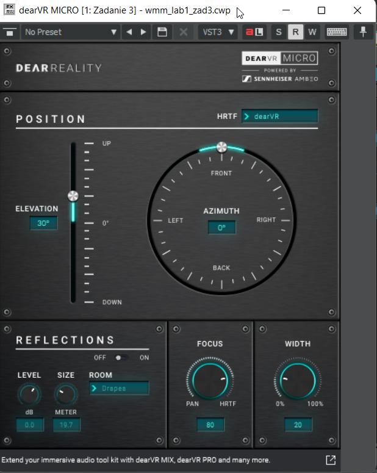

# WMM Lab3 - Dźwięk

Mikalai Stelmakh, 316951

## Zadanie 1. Filtracja

#### Zadanie 2

Zostały użyte filtry:

- **High-pass**
  - Frequency: 80 Hz
  - Q: 0.71
  - Slope: 3
- **High-shelf**
  - Frequency: 3500 Hz
  - Q: 0.99
  - Gain: 6 dB

#### Zadanie 4

Został użyty filtr **Peak**

- Frequency: 210 Hz
- Q: 10
- Gain: -24 dB

## Zadanie 2. Cyfrowe procesory dźwięku. Pogłos

#### Zadanie 2

> Który efekt pogłosu  powoduje, że słowa nie są tak dobrze rozpoznawalne między sobą?

Na pewno w przypadku *Big Vocal Hall* slowa są mniej rozpoznawalne.

#### Zadanie 3

Wykorzystana odpowiedź: *3800ms Pjan38*

### Kompresja dynamiki

#### Zadanie 2

> Efekt kompresji dynamiki możecie zaobserwować włączając przetwarzanie sygnału przez  efekt i zobrazowanie wyniku za pomocą przycisku Freeze Track.

Bez efektu:

Z efektem:

## Zadanie 3. Symulacja dźwięku przestrzennego 3D

#### Zadanie 1

> Sprawdź czy jesteś w stanie  zlokalizować źródło dźwięku w przestrzeni 3D z takiego kierunku, który ustawisz za  pomocą wartości azymutu i elewacji.

Tak, bez problemu można zlokalizować źródło dźwięku.

#### Zadanie 2

> Opisz krótko wszystkie parametry procesora  dźwięku dearVR MICRO i krótko opisz swoje wrażenia słuchowe podczas zmiany każdego z parametrów.

- **Azimuth** - ilość stopni rotacji źródła dźwięku wokół słuchacza. Po zmianie można usłyszeć jak zmienia się pozycja źródła dźwięku.
- **Elevation** - ilość stopni wysokości źródła dźwięku w trzy wymiarowej przestrzeni. Po zmianie można usłyszeć jak zmienia się pozycja źródła dźwięku w pionie.
- **Width** - kontroluje odległość między lewym i prawym kanałem.
- **Focus** - pozwala na regulację pomiędzy oryginalną barwą (0% - PAN) a eksternalizacją dźwięku 3D (100% - HRTF). Im większa wartość jest ustawiona, tym łatwiej jest zlokalizować źródło dźwięku.
- **Reflections** - kontroluje akustykę otaczającego wirtualnego pokoju w kształcie pudełka na buty.
  - **Level** - reguluje wzmocnienie odbić.
  - **Size** - dostosowuje wielkość symulowanego pomieszczenia (10-50m). Większy rozmiar powoduje późniejsze odbicia.
  - **Room** - daje różne opcje dla materiałów pokojowych, które prowadzą do różnych absorpcji częstotliwości.

## Zadanie 4. Synteza i MIDI

#### Zadanie 2

> Zmień kształt obwiedni za pomocą myszy i posłuchaj wpływu obwiedni na dźwięk.

Zmodyfikowany kształt obwiedni:

> Opisz  wrażenia słuchowe.

Po zmianie słychać, że zmienił się dźwięk w tle na końcu ścieżki.

#### Zadanie 5

> W tej ścieżce dodatkowo ustawiony jest procesor dźwięku  odpowiadający za modelowanie wzmacniacza gitarowego Blue Cat’s Free Amp. Spróbuj  zmienić jego parametry i posłuchaj wpływu na brzmienie.

Procesor dźwięku po zmianie:

> Opisz wrażenia.

Każdy parametr wydaje się mieć silny wpływ na brzmienie ścieżki.

#### Zadanie 6

> W tej ścieżce dodatkowo ustawiony jest  kompresor dynamiki wykorzystywany w zadaniu 1 i 2. Spróbuj zmienić jego parametry i  posłuchaj wpływu na brzmienie.

> Spróbuj dołożyć lub zmienić melodię/napisać własną za  pomocą układania „klocków” w sekcji piano roll.

